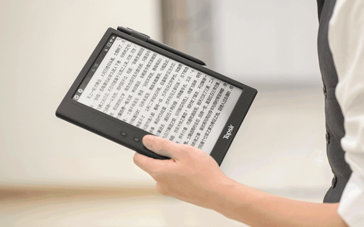

---

layout: post
title:	"海尔Topsir H9 使用体验"

---

# 引言
最近在咸鱼上买了个二手的电纸书-Topsir h9。是海尔的旗下的电纸书品牌。 h9代表它是一个9.7寸的大脸电纸书。
# 使用体验
显示：        我的kp1 是一代的，即使如此刚到手很明显察觉h9字体锯齿。显示效果不如kindle。  且对比度严重不足。  
漫画：     支持pdf，体验佳。不建议epub，打开缓慢。  
epub阅读：     很好，字体锯齿的问题在阅读时没有感觉，但在小字体时候很严重。  
pdf文档：     使用了裁剪后阅读体验佳。  
手写：        写字手感还不错，就是这功能本身对我就鸡肋。  
智能：        使用的是安卓4.0.4，懂的就了解了。  
kindle图书：   请自行百度kindle，DRM。  
视频功能：  我是有多闲才测试这个。“流畅”播放360p的《春物》。有多流畅就别追究了，总之它播了。  
# 感想
相当完美的购物（但这货零售价很高）。
# 总结
专注于阅读的好物品（换而言之不要追求他的其余功能)
# 参数
分辨率：1200x800  
背光：   ○
触控：   ○
笔触：   ○
耳机+外放：    ○  第三方软件：     佛系体验
